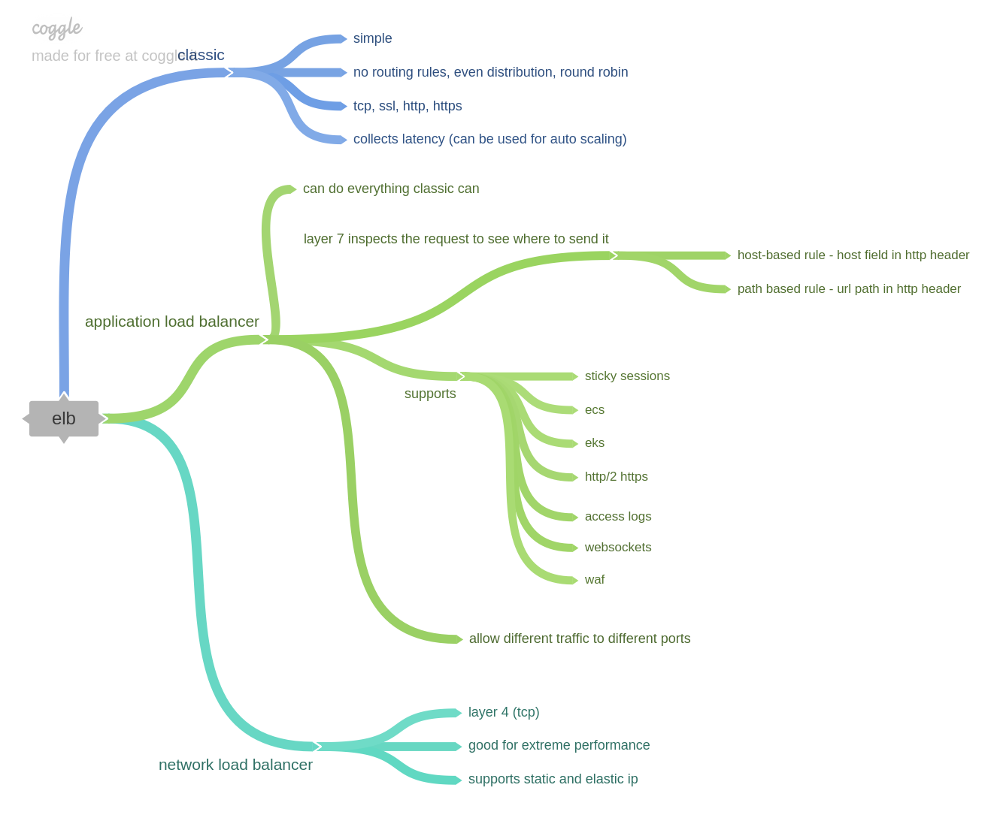
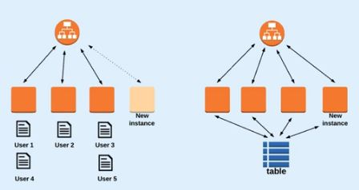

# high availability and fault tolerance

## elb (elastic load balancing)
- 5 public ip per region
- cross zone load balancing (works cross az)
- public or internal facing
- can work with auto scaling 
- different types of load balancer
    - classic
    - application load balancer
    - network load balancer

## servubg traffic to and from private subnets
- use elb to keep ec2 in private 
- use elb for https and traffic to ec2 in http 
- use jumpbox (bastion host) to access private networks

### nats
- layer 3 (proxy layer 4-7), nat for speed, less public ip and hiding private ips
- 2 types
    - nat gateway (aws service)
        - must be in public subnet
        - must be part of private subnet route table
    - nat instance (ec2 instance configured as nat)
- use nat for private subnet ec2 instances to access the internet (still uses internet gateway)

## vpc endpoints
- used for public aws services
- examples s3 bucket, or dynamodb
- without an endpoint you would have to use a nat and go via the internet to get data from a private subnet to a service like dynamodb
- update private subnet route tables to use endpoints
- can set polcies to the endpoint rule
- 2 types
    - gateway endpoint
        - dynamodb
        - s3
    - interface endpoints
        - cloudwatch
        - codebuild
        - kms
        - kinesis
        - service catalog

## autoscsaling
- based on cloudwatch monitoring
- auto scaling components
    - launch configuration
        - which templates to use, AMI etc 
    - autoscaling group
        - rules to govern to provision and destory 
        - min/max instances
        - elb
        - sns notification
    - cloudwatch alarms
        - metrics to trigger scaling (cpu, latency)

## stateless applications
- stateless = user logins and session is stored externally (a db or cache server or file system - dynamodb / redis)
    - allows instant scaling
- stateful = user logins and session is kept on web server 
    - use sticky sessions on the elb to for stateful (creates cookie for client)
  

  
## high availbilty vs fault tolerance 
- ha
    - ensures availbilty of service
- ft
    - ensures availbility of service
    - performance statbility 
  
- solution
    - scalability
        - scale up or out (up increase server spec, out increase number of servers)
    - elastcity
        - ability to update system
    - cost efficent
        - trade offs of cost to ha/ft
    - secure
        - ensure security bp are kept
          
[home](../README.md)